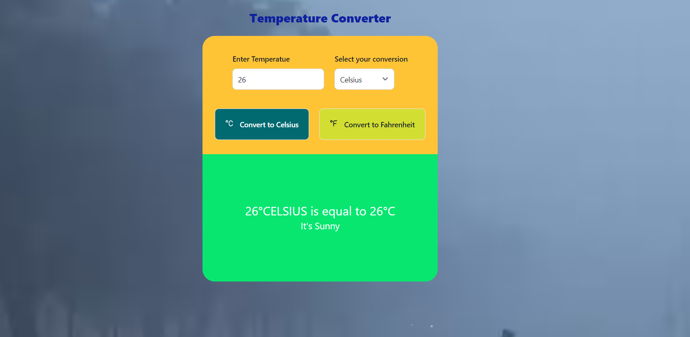
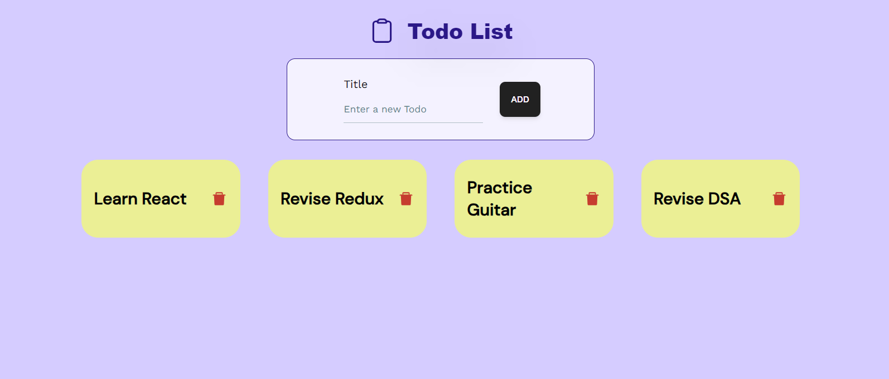
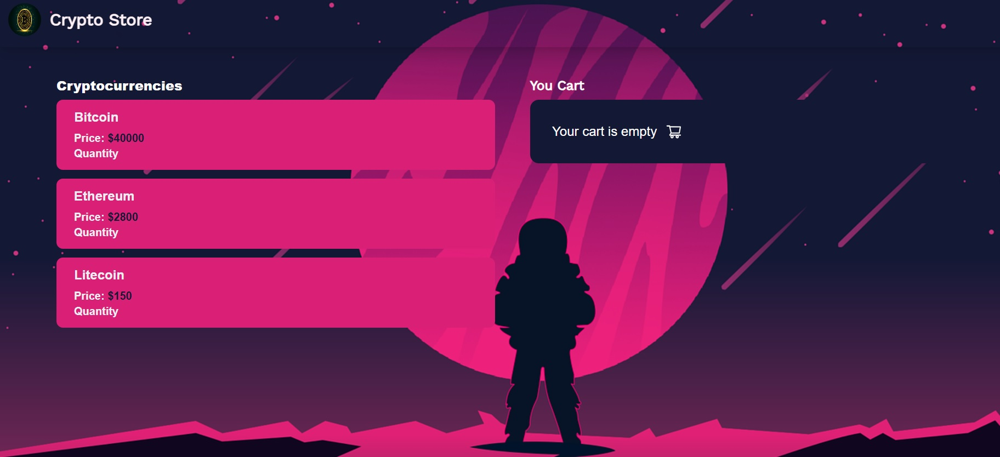

# Virsoftech Coding Assignment 

## Introduction

Welcome to the Virsoftech coding assignment repository! This repository contains the code and resources for assignment.The assignment is primarily focused on evaluating frontend development skills,

1.  https://temperate-converter.vercel.app/
2.  https://todo-app-tarun-upadhyay.vercel.app/
3.  https://crypto-purchase-fawn.vercel.app/
---
## Assignment 1: Temperature Converter
###  [Github](https://github.com/tarun-upadhyay/virsofttect-ass/tree/main/temperatue-converter)  <> [Deployed](https://temperate-converter.vercel.app/)
## Description

In the Temperature Converter assignment, we will build a simple application that allows users to convert temperatures between different units (e.g., Celsius, Fahrenheit). The application should provide a user-friendly interface for inputting a temperature value and selecting the desired units for conversion. When the user submits the form, the application should display the converted temperature.

- Tech Stack
  - ReactJs
  - Tailwind Css
 - Glimpses

---

## Assignment 2: Todo App
###  [Github](https://github.com/tarun-upadhyay/virsofttect-ass/tree/main/todo-app) <> [Deployed](https://todo-app-tarun-upadhyay.vercel.app/)
## Description

The Todo App assignment involves developing a task management application where users can create, and delete their to-do lists. 

- Tech Stack
  - ReactJs
  - Tailwind Css
- Glimses

  
---
## Assignment 3: Crypto Store
###  [Github](https://github.com/tarun-upadhyay/virsofttect-ass/tree/main/crypto-purchase) <> [Deployed](https://crypto-purchase-fawn.vercel.app/)
## Description

A Small crypto storefront where users can select among 3 cryptocurrencies, like (Bitcoin, Ethereum, Litecoin), input their desired quantity, and their selection to a cart below
- Tech Stack
  - ReactJs
  - Tailwind Css
- Glimpses

---
## Getting Started

Provide instructions on how to get the project up and running.


### Installation

1. Clone this repository:

   ```bash
   git clone https://github.com/tarun-upadhyay/virsofttect-ass/tree/main
   ```
2. cd (app dir)
```bash
cd crypt-purchase
```

```
npm install
npm start
```

# Thank You for reading this.


